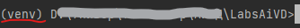
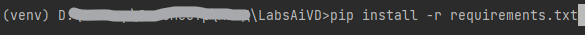

# Лабораторные работы по дисциплине "Анализ и визуализация данных"

### Требования к системе
- Python версии 3.8 и выше

### Подготовка системы

Для запуска лабораторных работ необходимо открыть папку с лабораторными через терминал или открыть папку с лабораторными работами с помощью IDE (например, VSCode).

Необходимо проверить наличие установщика python пакетов pip с помощью следующей команды:
```
pip --version
```

Далее необходимо создать виртуальное окружение (в папке проекта!) с помощью следующей команды:
```
python -m venv venv
или
python3 -m venv venv
```

В папке проекта должна появиться папка venv.
Для установки необходимых библиотек необходимо активировать виртуальное окружение.
Чтобы активировать виртуальное окружение, необходимо ввести в терминале в папке проекта следующую команду:
```
Для Windows:
Путь\к\папке\проекта>venv\Scripts\activate

Для Linux:
Путь\к\папке\проекта>source venv\bin\activate
```

После выполнения команды окно терминала должно выглядеть следующим образом:



Установка пакетов с помощью pip:
